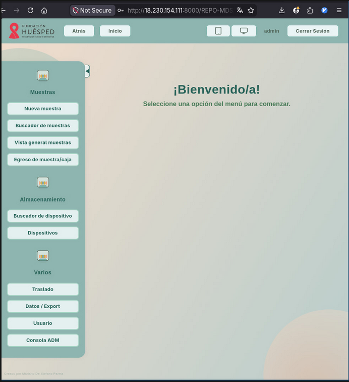
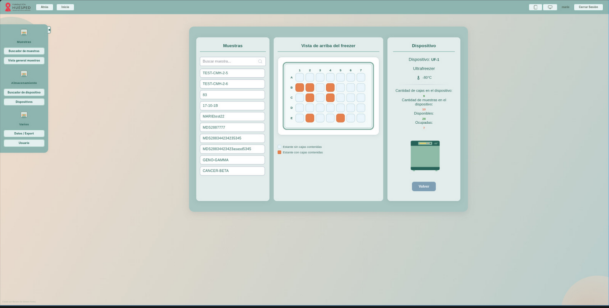

# Biobank Infrastructure - Fundación Huésped

[](https://github.com/Sevamiau/biobank-infra/actions/workflows/ci.yml)


Fundación Huésped (Buenos Aires, Argentina) runs a PHP-based biobank system for tracking biological sample locations across storage devices: freezers, fridges, liquid nitrogen tanks. The app existed but had no reproducible deployment: getting it running on a new machine required manual setup.

I containerized it with Docker Compose so the full stack can be started with a single command on any Linux machine with Docker. The foundation adopted this setup and currently runs it on-premises.

I also designed a low-cost AWS architecture as a proposal for cloud access, documented in `terraform/`, but the foundation has not yet adopted it.

> The application source code is proprietary and not included here. This repo contains the Docker infrastructure, operational tooling, and proposed AWS deployment design.

---

## What this repo demonstrates

- **Dockerization of a legacy PHP app** - PHP 8.2 + Apache + Laravel bridge, containerized from an existing codebase
- **Docker Compose** orchestration: web, database, and backup services with proper network isolation
- **Security**: internal Docker network for the database, least-privilege DB user, no credentials in the repo
- **Automated backups**: daily `mysqldump` with 7-day rotation, password never exposed in the process list
- **Proposed AWS architecture**: EC2 + Nginx + Terraform, chosen over Fargate/RDS for NGO budget constraints
- **CI pipeline**: GitHub Actions validates the Docker build and Terraform configuration on every push

---

## Repository structure

| File / Dir | Description |
|---|---|
| `Dockerfile` | PHP 8.2 + Apache image with Composer dependencies |
| `docker-compose.yml` | Orchestrates web, database, and backup services |
| `backup.sh` | Daily `mysqldump` with 7-day rotation |
| `entrypoint.sh` | Ensures storage directories and `APP_KEY` are ready before Apache starts |
| `.env.example` | Environment variable template (credentials are never committed) |
| `init-db/` | Schema and least-privilege user SQL, auto-imported by MariaDB on first start |
| `terraform/` | Proposed AWS infrastructure (EC2, Security Group, Elastic IP, Nginx bootstrap) |
| `app/` | Mount point for the application source, see `app/README.md` |

---

## Architecture

```
Browser
    │
    ▼
web  (PHP 8.2 + Apache, port 8000)
    │  bind-mount: ./app → /var/www/html
    │
    └── db  (MariaDB 10.11 - internal network only)
         │
         └── backup  (mysqldump every 24h → ./backups/)
```

`db` and `backup` sit on a `backend` network marked `internal: true` - the database is unreachable from outside Docker. `web` is on both networks: it talks to the database over the backend, and to the outside world over the frontend.

---

## Screenshots

| Dashboard | Ultrafreezer view |
|---|---|
|  |  |

---

## Local deployment

The setup currently running at the foundation.

```bash
# 1. Clone
git clone <repo-url>
cd biobank-infra

# 2. Set credentials
cp .env.example .env
# Edit .env: set DB_PASSWORD, DB_ROOT_PASSWORD, APP_URL=http://localhost:8000

# 3. Place the app source in app/ (see app/README.md)

# 4. Start
docker compose up --build -d

# Wait 15s for MariaDB to import the schema. Then open http://localhost:8000
```

---

## Backups

The `backup` service runs alongside the app and dumps the database every 24 hours:

```
backups/cajassistema_2026-05-18_03-00-00.sql.gz
```

Dumps older than 7 days are deleted automatically. To restore:

```bash
gunzip -c backups/cajassistema_<date>.sql.gz | \
  docker compose exec -T db mariadb -u"$DB_USERNAME" -p"$DB_PASSWORD" cajassistema
```

## Resetting the database

```bash
docker compose down -v   # drops the db_data volume
docker compose up --build -d
```

## Troubleshooting

**Permission errors on storage directories:**
```bash
docker compose exec web chown -R www-data:www-data frmwk/storage frmwk/bootstrap/cache
```

**Fedora/RHEL - site times out:**
```bash
sudo systemctl stop firewalld
```

---

## TODO

- CD step in GitHub Actions: push to master auto-deploys to the server via SSH
